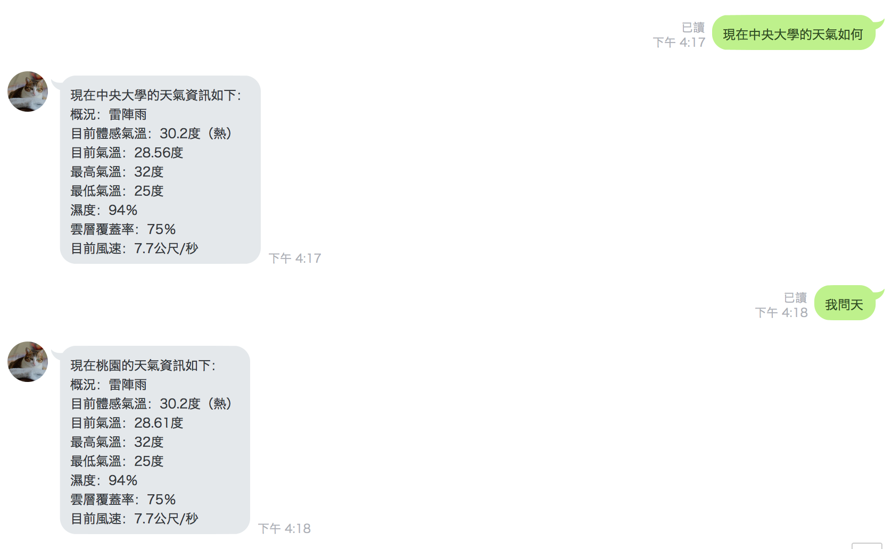
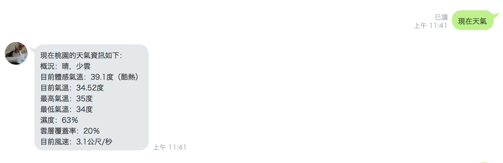
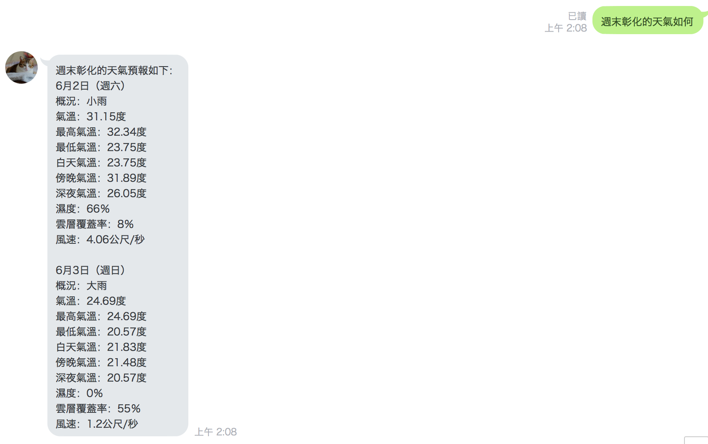
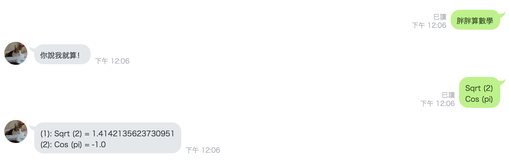
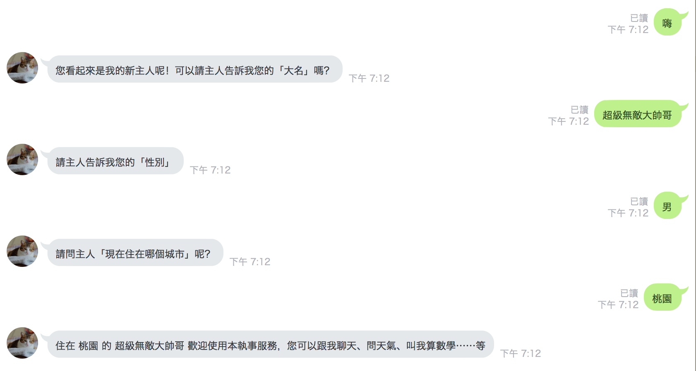

# Linbot
## Description
SN: 106522103
Using Google Dialogflow v2 API Integrat to LineBot
Server is using python3 Flask
## Main Functions
1. Ask weather in Universal Language

2. Ask Math function

3. Ask near by N km good place

## Sub Functions
- smalltalk project

## Try it
- LineID: @xth8958g

